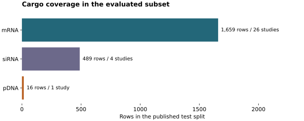
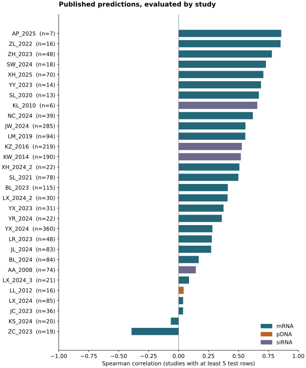

# LNPDB–HHES Benchmark

[](https://github.com/ju2501/lnpdb-hhes-benchmark/actions/workflows/ci.yml)

A CPU-only workflow for auditing published **LiON** predictions and finding
formulation comparisons relevant to future **HHES** case studies.

**Research question:** when the ionizable lipid is held fixed, how well do model
predictions reflect differences between formulations, and what limits transfer
to a new cargo, cell system, or assay?

Version 0.1 evaluates public predictions and prepares a reviewable comparison
dataset. It does not train LiON, run a checkpoint, or claim validated HHES efficacy
prediction. Experimental HHES data are not included in this repository.

## What works now

- Download four public CSV files from an immutable LNPDB commit and verify both
  SHA-256 and Git blob hashes.
- Recalculate overall, cargo-level, and study-level prediction metrics, with cargo coverage
  counts and publication-ready SVG figures.
- Identify same-lipid formulation-comparison candidates using recorded context.
- Require explicit source review before evaluating candidate groups.
- Check lab metadata against the pinned 92-feature schema without silently
  replacing unsupported categories such as Jurkat.

## Reproduced public results

Source: [`evancollins1/LNPDB`, commit `fc7c389`](https://github.com/evancollins1/LNPDB/tree/fc7c38933b445eb54985014f2b8917606462eec1/data/LNPDB_for_LiON/single_split).
These are **test-subset** results, not counts for the whole LNPDB.

| Cargo | Test rows | Experiment IDs |
|---|---:|---:|
| mRNA | 1,659 | 26 |
| pDNA | 16 | 1 |
| siRNA | 489 | 4 |

Across the 2,164 supplied test rows, Pearson correlation is **0.481876** and RMSE
is **0.911933** in the source target's standardized units. The pDNA subset is
entirely `LL_2012`, with Spearman correlation approximately **0.0426**. This small
subset does not establish general pDNA performance.





Exact matching identifies **69 candidate groups / 213 rows / 15 IL structures**
with different component ratios. All belong to the `JW_2024` mRNA study. They are
**unreviewed candidates**: the supplied feature columns do not establish that all
assays and time points match. Holding IL and PEG percentages fixed while allowing
only helper/cholesterol percentages to vary yields **0 exact candidate groups in
this test subset**.

Full numeric outputs: [public audit](reports/public_snapshot/README.md),
[candidate summary](reports/candidates/summary.json), and
[strict comparison summary](reports/helper_cholesterol/summary.json).

## Quick start

Requires Python **3.10 or newer**, with no GPU, PyTorch, Chemprop, RDKit, or conda
required for this release. See the [Chromebook guide](docs/CHROMEBOOK.md).

Clone the repository, then create an isolated environment:

```bash
git clone https://github.com/ju2501/lnpdb-hhes-benchmark.git
cd lnpdb-hhes-benchmark
python3 -m venv .venv
source .venv/bin/activate
python -m pip install --upgrade pip
python -m pip install -e .

lnpdb-hhes fetch
lnpdb-hhes benchmark
lnpdb-hhes candidates
lnpdb-hhes candidates --vary helper-cholesterol --out outputs/helper_cholesterol
python -m unittest discover -s tests -v
```

The download is approximately **1.2 MB**. Cache files live in
`data/raw/single_split/`; new analysis outputs go to `outputs/`. Both are ignored
by Git. Once the cache is available, analysis runs offline.

`python -m lnpdb_hhes` is equivalent to `lnpdb-hhes`. Use `--help` for arguments.
For a damaged cache, run `lnpdb-hhes fetch --refresh`; do not edit the source CSVs.

See the [validation record](docs/VALIDATION.md) for the tested environment,
commands, and limits of verification.

## Review before evaluating formulation comparisons

```bash
lnpdb-hhes candidates
cp outputs/candidates/curation_template.csv outputs/curation.csv
# Review the original study, then edit outputs/curation.csv.
lnpdb-hhes evaluate-curated --curation outputs/curation.csv
```

Every row initially has `decision=unreviewed`. For an included group, record the
source, readout method, time in hours, and a comparability note. Running evaluation
on the untouched template intentionally returns an error.

The evaluator reports descriptive group-level metrics and an equal-weighted
mean direction score. Observed ties are excluded; prediction ties receive half
credit. Tolerances are configurable and saved with the output. Pairs sharing a
lipid or experiment are not independent replicates. Read
[METHODS.md](docs/METHODS.md) before interpreting these metrics.

## Add a future HHES case locally

```bash
lnpdb-hhes lab-template
# Fill data/private/formulations.csv using lab records.
lnpdb-hhes assess-lab --input data/private/formulations.csv
```

The assessment reports missing metadata, composition-unit problems, and unknown
model categories. Even a complete row remains `prediction_ready=false`: chemical
identity, assay comparability, and training-domain coverage still need review.
The checker is **not** a SMILES validator or inference adapter.

See the [lab data dictionary](docs/LAB_DATA.md). Raw FCS files and local lab data
belong outside the committed public dataset. `.gitignore` prevents routine
staging of `data/private/` and FCS files; review staged files before publishing.

## Scientific scope

- The original public split is described as amine-based. Re-evaluating its study
  subsets is not a new study-held-out validation.
- LiON's standardized target is not EGFP-positive cells (%), raw luminescence,
  or a probability. No conversion to a FACS percentage is performed.
- Same-IL comparison evaluates responses to formulation/context inputs. It does
  not, by itself, validate generalization to new ionizable lipid structures.
- Two formulations support a descriptive comparison, not a robust correlation
  claim. Correlations for fewer than three rows are suppressed.
- Post hoc subsets used to guide model changes become development data. A new
  claim of improvement needs an evaluation set kept separate from that work.
- One future HHES mRNA formulation is a case study, not evidence of mRNA-to-pDNA
  transfer performance. Reporter expression alone does not establish knock-in.

## Project map

| Location | Contents |
|---|---|
| `src/lnpdb_hhes/` | Fetching, validation, evaluation, candidate matching, lab metadata checks |
| `src/lnpdb_hhes/snapshot.json` | Immutable source URLs, hashes, and exact feature order |
| `tests/` | Synthetic edge cases and public-snapshot regression checks |
| `reports/` | Reproducible public results and SVG figures |
| `docs/` | Methods, Chromebook setup, lab schema, validation, next steps |
| `third_party/` | Upstream LNPDB license |

## Roadmap

1. Curate same-IL comparisons against original study records.
2. Add study-held-out public evaluations with checkpoint-specific reference data.
3. Validate chemical identity and build a checkpoint-compatible input adapter.
4. Add permitted HHES pDNA/mRNA case studies with batch and assay provenance.
5. Optionally compare AGILE on the same evaluation target; treat Martini MD as a
   separate, later mechanistic study.

See [ROADMAP.md](docs/ROADMAP.md) for the thesis connection and acceptance criteria.

## Attribution

This independent analysis project builds on:

- [LNPDB](https://github.com/evancollins1/LNPDB) and
  [Collins et al., Nature Communications (2026)](https://doi.org/10.1038/s41467-026-68818-1).
- [LNP_ML / LiON](https://github.com/jswitten/LNP_ML), the original model and
  data-processing workflow.
- [AGILE](https://github.com/bowang-lab/AGILE), a possible future comparison model.
- [Martini 3 ionizable lipids](https://github.com/Martini-Force-Field-Initiative/M3_Ionizable_Lipids),
  a possible future simulation resource.

This repository does not claim authorship of these models or their experimental
data. Source-derived files retain the upstream license in `third_party/`.
Original code in this repository is released under the [MIT license](LICENSE).
